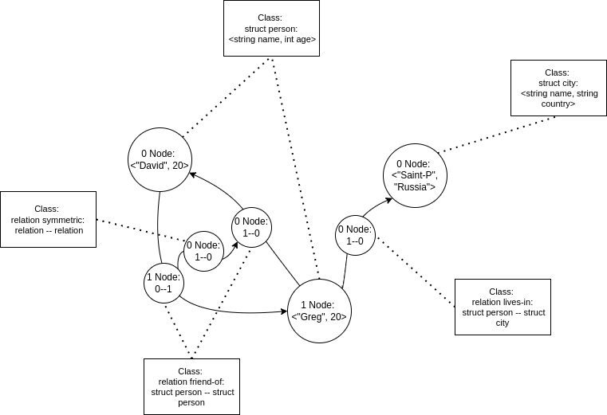
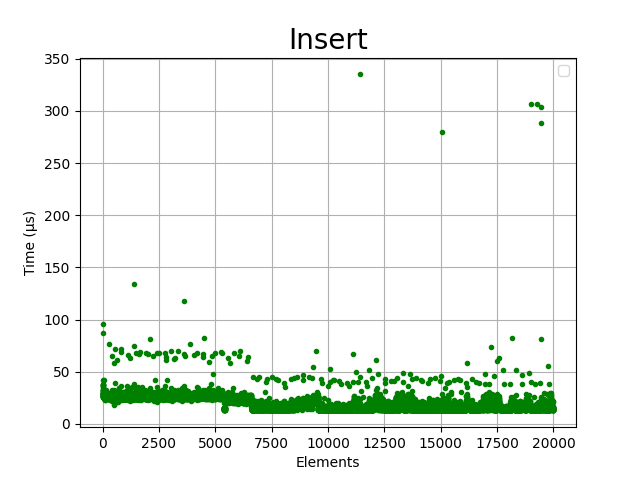
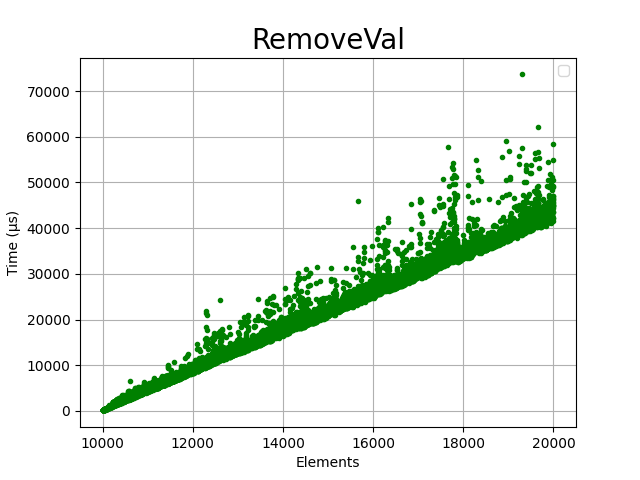
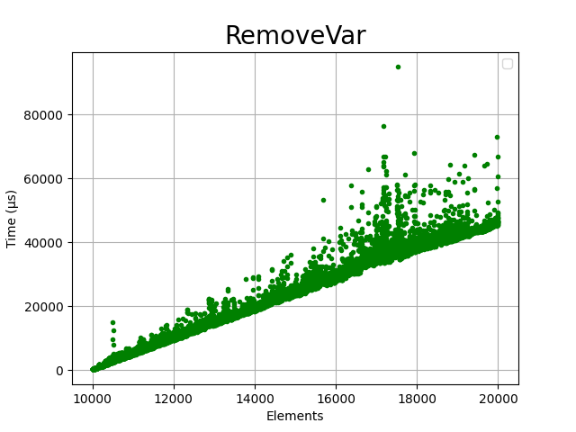
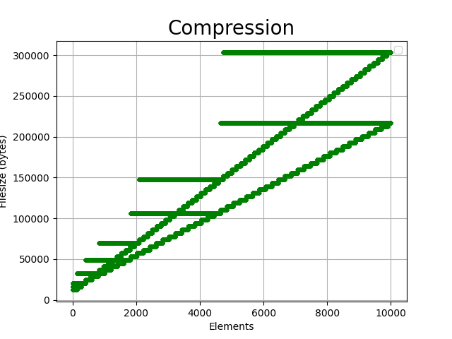

# DaedalusDB

Self-implemented persistent RAG-storage. 

## Install

If you want to build it manually be sure that you have C++23 clang++-18 and libc++-18 installed otherwise it will not build.

### Docker
1. Clone repo via:
   ```console
   git clone https://github.com/Hyperb0rean/DaedalusDB.git && cd DaedalusDB
   ```
3. Build docker container:
   ```console
   docker build . -t ddb
   ```
4. Run code in *main.cpp* :
   ```console
   docker run ddb
   ```
   
TODO: Add volumes support.

## API

**ADIO** means that all of data that your store in database is stored as *Objects*, so:

1. *Nodes* are *Objects* 
2. *Relations* are *Objects*
3. *Subgraphs* are *Objects* (*PatternMatch* result is a Struct after contractions of all relations in subgraph that matches the pattern given)

 

Sofor example it adds possibilities to make Relations of higher orders and Pattern Match pipelines.

Every *Object* have *Class* that describes it's signature:

### Class declaration
```cpp
using namespace ts;
 auto person_class = NewClass<StructClass>(
        "person", NewClass<StringClass>("name"), 
        NewClass<StringClass>("surname"),
        NewClass<PrimitiveClass<int>>("age"),
        NewClass<PrimitiveClass<bool>>("male"));

auto coordinates_class = NewClass<StructClass>(
        "coordinates", NewClass<PrimitiveClass<double>>("lat"),
        NewClass<PrimitiveClass<double>>("lon"));

auto city_class = NewClass<StructClass>("city", 
            NewClass<StringClass>("name"), 
            coordinates_class);

```

### Object definition

DDB has no implicit type conversion of any kind, so C++ number literal should be casted to match class signature.
This occures due to Type erasure to *std::any* during object definition, maybe I will change this in future.

```cpp
using namespace ts;
auto address_class = NewClass<StructClass>(
        "address", NewClass<StringClass>("city"),
        NewClass<StringClass>("street"),
        NewClass<PrimitiveClass<size_t>>("house"));
auto person_class = NewClass<StructClass>(
        "person", NewClass<StringClass>("name"),  
        NewClass<StringClass>("surname"),
        NewClass<PrimitiveClass<int>>("age"), address_class);

auto greg = New<Struct>(person_class, std::format("Greg {}",1),
"Sosnovtsev", 20, "Saint-Petersburg", "Nevskiy prospekt", static_cast<size_t>(28));
```


### Simple node addition 

```cpp
auto database = db::Database(util::MakePtr<mem::File>("perf.ddb"), db::OpenMode::kWrite);

auto name = ts::NewClass<ts::StringClass>("name");

database.AddClass(name);

database.AddNode(ts::New<ts::String>(name, "test name"));
```


### Simple relation addition

As for other *Objects* arguments during *Relation* definition should be explicitlty converted to *ObjectId* with built-in macro *ID*

```cpp
using namespace ts;
auto point =
        NewClass<StructClass>("point",
        NewClass<PrimitiveClass<double>>("x"),
        NewClass<PrimitiveClass<double>>("y"));

auto connected = NewClass<RelationClass>("connected",point,point);

auto database = db::Database(util::MakePtr<mem::File("test.data"));
database.AddClass(point);
database.AddClass(connected);

database.AddNode(New<Struct>(point, 0.0, 1.0));
database.AddNode(New<Struct>(point, 0.0, 0.0));
database.AddNode(New<Relation>(connected, ID(1), ID(0)));
database.AddNode(New<Relation>(connected, ID(0), ID(1)));
```

### Pattern Matching

```cpp
auto pattern = util::MakePtr<db::Pattern>(point);
pattern->AddRelation(connected, [](db::Node point_a, db::Node point_b) {
        return point_a.Data<ts::Struct>()->GetField<ts::Primitive<double>>("y")->Value() >
               point_b.Data<ts::Struct>()->GetField<ts::Primitive<double>>("y")->Value();
});
std::vector<ts::Struct::Ptr> result;
database.PatternMatch(pattern, std::back_inserter(result));
```

For more examples you can check tests folder, there are some smoke tests which I made during development.


## Tests and Performance

GTest were used for testing, only Smoke tests were made so any API testing PRs are highly welcome. You can also see more of API possibilities in tests. 

## Insertion

Insertion of simple elements.

 

Time complexity: **O(1)**

## Deletion

Removal of valued size and variable sized objects into database. The Logic of Iterators are little bit different and Valued sized Objects Storage had some optimizations hence the performance could be different.

 

 

Time complexity: **O(|A|)** where A is set of elements of certain class.


## Compression

The database some primitive file compression mechanism implemented so filesize is linear to the overall number of elements.

 

## Match

Here is some performance test for Pattern Matching of simple pattern (see *performance_test.cpp*). Time complexity analysis is pretty complex so I left it for future, but it definitely depends on number of verticies and edges. 

 

___


If you want to contribute you are welcome :)
